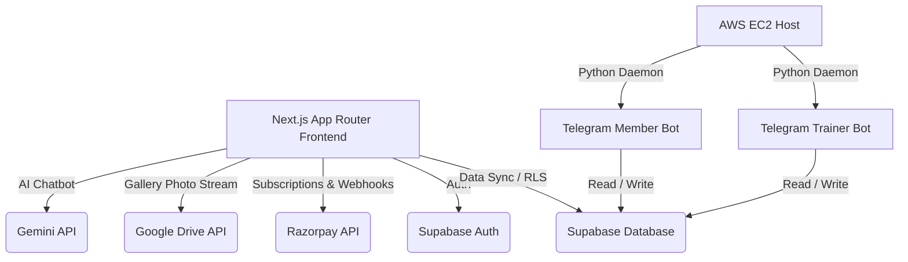

# Stitch Apex Elite — Design & System Architecture

This document describes the complete system design, full-stack architecture, and database layout for the **Stitch Apex Elite** fitness gym web platform, based on the blueprint from `.claude/FitnessGym_Website_Plan_1.docx`.

---

## 1. System Architecture



---

## 2. Page & Navigation Details

### 2.1 Public Pages (Accessible to All)
- **Home (`/`)**: Landing page showcasing gym overview, high-performance WebGL hero visualizer, location map, contact forms, and Google reviews.
- **About (`/about`)**: Story of the gym, core values, trainer profiles, and facilities with 3D model integration.
- **Services (`/services`)**: Pricing summaries and subscription tiers.
- **Gallery (`/gallery`)**: Photo stream displaying events. Fetches media from Google Drive via event mapping.
- **Sign In (`/signin`)**: Secure login panel using email/password and Google OAuth credentials.
- **Sign Up (`/signup`)**: Account registration form capturing Name, Phone, Email, and Password.

### 2.2 Protected Pages (Requires Auth)
- **Dashboard (`/dashboard`)**: The client interface containing user telemetry, workout progress, Goals Tracker, BMI Calculator, and the Digital Membership Card. Full feature access is unlocked *only* after active payment verification.
- **Payment Gateway (`/dashboard/payment`)**: Embedded payment screen inside the dashboard for unpaid members. This page is kept hidden from public navigation.
- **Admin Panel (`/admin`)**: Special dashboard access for administrators. Supports:
  - Viewing totals of registered/active members.
  - Adding events (automatically assigns sequential Event IDs).
  - Uploading photos to events (saving directly to Google Drive folder).

---

## 3. Database Schema (Supabase / Postgres)

The system utilizes Postgres schemas managed in Supabase. Row Level Security (RLS) protects client data.

### 3.1 Tables Structure

#### `users`
Tracks member profiles, roles, and administrative flags.
```sql
CREATE TABLE public.users (
    id UUID PRIMARY KEY REFERENCES auth.users(id) ON DELETE CASCADE,
    name VARCHAR(255) NOT NULL,
    email VARCHAR(255) UNIQUE NOT NULL,
    mobile VARCHAR(20) UNIQUE,
    role VARCHAR(20) DEFAULT 'user', -- 'user' or 'admin'
    created_at TIMESTAMP WITH TIME ZONE DEFAULT timezone('utc'::text, now()) NOT NULL,
    additional_details JSONB
);
```

#### `subscriptions`
Stores subscription records synced from Razorpay payment webhooks.
```sql
CREATE TABLE public.subscriptions (
    id UUID PRIMARY KEY DEFAULT gen_random_uuid(),
    user_id UUID REFERENCES public.users(id) ON DELETE CASCADE,
    plan VARCHAR(50) NOT NULL,
    status VARCHAR(20) NOT NULL, -- 'unpaid', 'paid', 'expired'
    razorpay_payment_id VARCHAR(100),
    start_date TIMESTAMP WITH TIME ZONE,
    end_date TIMESTAMP WITH TIME ZONE,
    created_at TIMESTAMP WITH TIME ZONE DEFAULT timezone('utc'::text, now()) NOT NULL
);
```

#### `digital_cards`
Generated membership cards containing QR credentials. Only created for paid members.
```sql
CREATE TABLE public.digital_cards (
    id UUID PRIMARY KEY DEFAULT gen_random_uuid(),
    user_id UUID UNIQUE REFERENCES public.users(id) ON DELETE CASCADE,
    card_number VARCHAR(50) UNIQUE NOT NULL,
    issued_at TIMESTAMP WITH TIME ZONE DEFAULT timezone('utc'::text, now()) NOT NULL,
    valid_until TIMESTAMP WITH TIME ZONE NOT NULL
);
```

#### `events` & `event_categories`
Handles event categorizations. Events feature an auto-incrementing sequential integer ID.
```sql
CREATE TABLE public.event_categories (
    id SERIAL PRIMARY KEY,
    name VARCHAR(100) UNIQUE NOT NULL,
    created_by UUID REFERENCES public.users(id),
    created_at TIMESTAMP WITH TIME ZONE DEFAULT timezone('utc'::text, now())
);

CREATE TABLE public.events (
    id SERIAL PRIMARY KEY, -- Generates sequential integers (EVT-0001 mapping can be processed at application layer)
    title VARCHAR(255) NOT NULL,
    category_id INTEGER REFERENCES public.event_categories(id) ON DELETE SET NULL,
    description TEXT,
    created_by UUID REFERENCES public.users(id),
    created_at TIMESTAMP WITH TIME ZONE DEFAULT timezone('utc'::text, now())
);
```

#### `gallery_photos`
Keeps image references pointing to Google Drive assets.
```sql
CREATE TABLE public.gallery_photos (
    id UUID PRIMARY KEY DEFAULT gen_random_uuid(),
    event_id INTEGER REFERENCES public.events(id) ON DELETE CASCADE,
    drive_file_id VARCHAR(255) NOT NULL,
    drive_url TEXT NOT NULL,
    title VARCHAR(255),
    uploaded_at TIMESTAMP WITH TIME ZONE DEFAULT timezone('utc'::text, now())
);
```

---

## 4. Google Drive Media Pipeline

To keep web hosting costs minimal, the platform integrates **Google Drive** for high-resolution gallery storage.

1. **Upload Trigger**: Admin uses the admin panel to upload photos to a selected Event.
2. **Drive API Upload**: The Next.js API route receives the file buffer and pushes it to a nested directory on Google Drive matching `FitnessGymMedia/Gallery/[EventName-EventID]/`.
3. **Permission Check**: The API route changes the file permissions to public read (`Anyone with link can view`).
4. **Database Logging**: The Drive File ID and Shareable Web Embed URL are recorded in `gallery_photos`.
5. **Renders**: The Gallery page fetches the URLs from Supabase and embeds them in responsive frames on the client side.

---

## 5. Dual Telegram Bots Integration

The system hosts two separate bots deployed via Python daemon scripts on AWS EC2.

### 5.1 Member Bot (`@My_gym_tranning_bot`)
- **Target**: Registered Gym Members.
- **Operations**:
  - Broadcasts automated workout plans, diet regimes, and daily motivational quotes.
  - Sends reminders before subscription expiration dates.
  - Allows members to query their BMI records and goals status.

### 5.2 Trainer/Owner Bot (`@My_fitnesz_gym_bot`)
- **Target**: Administrative Staff & Personal Trainers.
- **Operations**:
  - Pushes instant alerts when a new user signs up or processes a payment.
  - Generates daily user registration/active charts.
  - Permits trainers to post announcements and notify members of new Events.

---

## 6. Integration Endpoints & APIs

- **Razorpay API**: Handles checkout flows and processes subscription webhooks at `/api/payment/webhook` to update member levels.
- **Gemini Chatbot**: Integrates a floating widget using Gemini APIs to offer AI-powered personal training Q&A and general gym FAQs.
- **Google Reviews (Places API)**: Dynamically fetches user testimonials. Implements a server-side filter:
  ```typescript
  // Filters out reviews with low ratings to ensure high quality presentation
  const filteredReviews = reviews.filter((r) => r.rating >= 3);
  ```

---

## 7. Environment Variables Required (.env)

```env
# Supabase Keys
NEXT_PUBLIC_SUPABASE_URL=your_supabase_url
NEXT_PUBLIC_SUPABASE_ANON_KEY=your_supabase_anon_key
SUPABASE_SERVICE_ROLE_KEY=your_supabase_service_role_key

# Razorpay Keys
RAZORPAY_KEY_ID=your_razorpay_key_id
RAZORPAY_KEY_SECRET=your_razorpay_key_secret
RAZORPAY_WEBHOOK_SECRET=your_razorpay_webhook_secret

# Google APIs
GOOGLE_DRIVE_CLIENT_ID=your_gdrive_client_id
GOOGLE_DRIVE_CLIENT_SECRET=your_gdrive_client_secret
GOOGLE_DRIVE_REFRESH_TOKEN=your_gdrive_refresh_token
GOOGLE_PLACES_API_KEY=your_google_places_api_key

# Gemini AI
GEMINI_API_KEY=your_gemini_api_key

# Telegram Tokens
TELEGRAM_MEMBER_BOT_TOKEN=your_member_bot_token
TELEGRAM_TRAINER_BOT_TOKEN=your_trainer_bot_token

# Workout & Diet APIs
TRAINING_API_KEY=your_training_videos_api_key
DIET_PLAN_API_KEY=your_diet_plan_api_key
```
